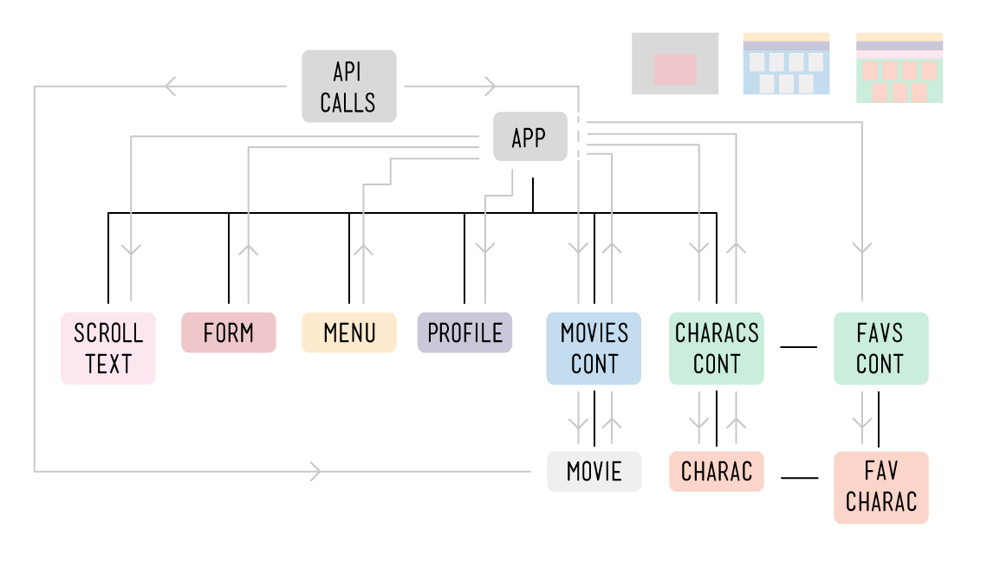
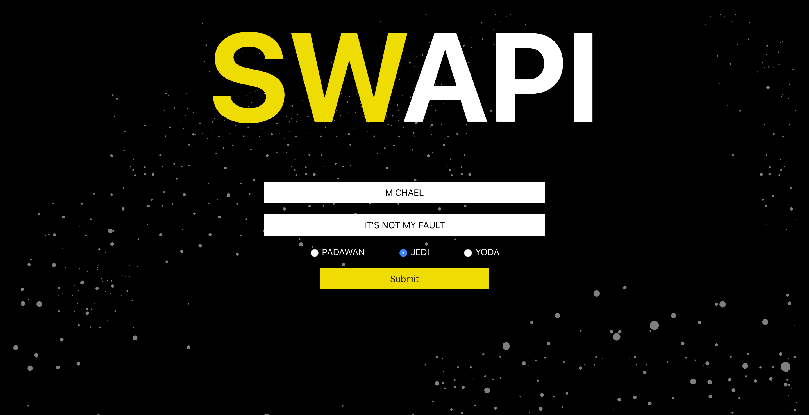
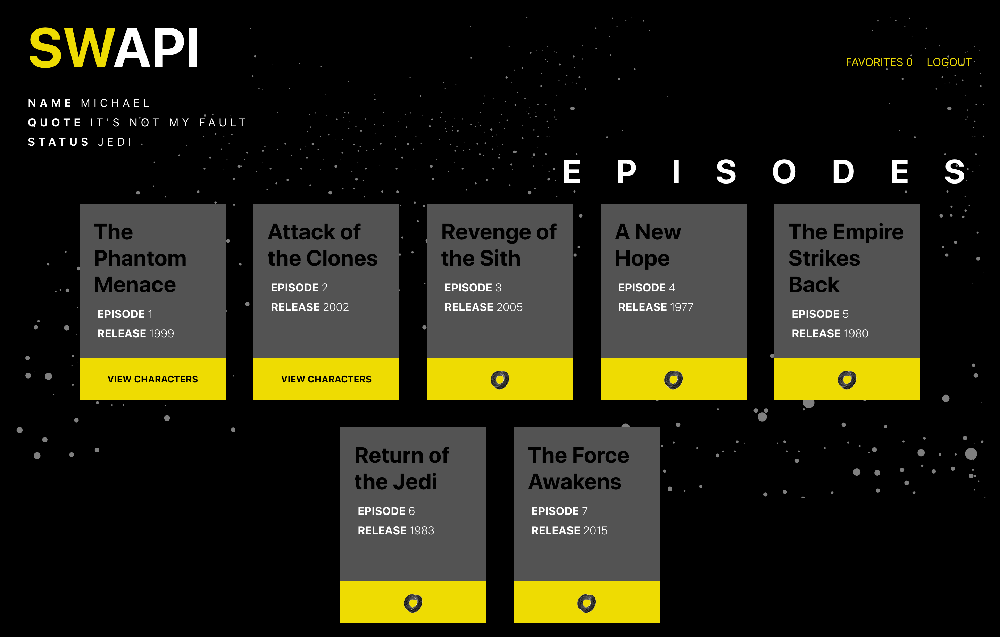
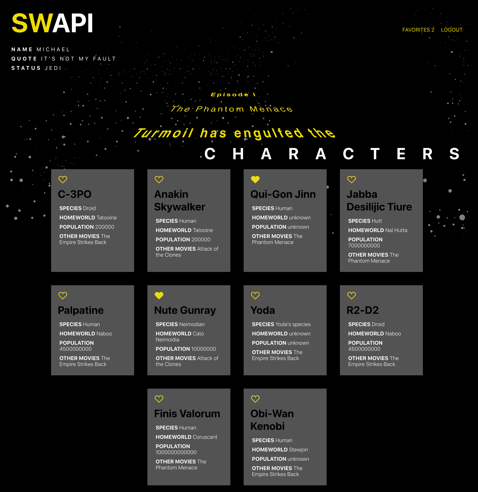
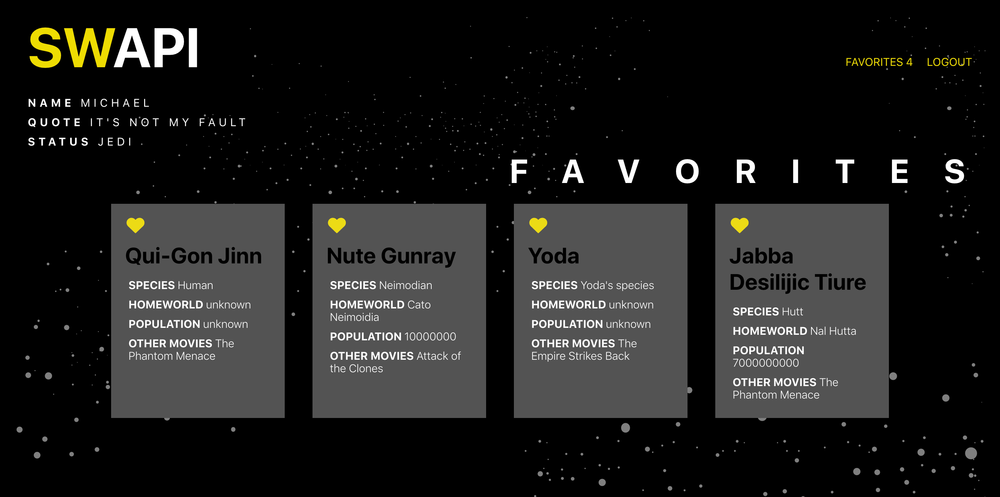

# SWAPI

SWAPI is a React App based around the Star Wars API that displays different categories of star wars data, starting with movies, then diving deeper into 10 characters for that movie. Users are able to favorite their favorite characters and view them on a favorites page.

### Focuses

- Write squeaky clean, well refactored code using ES6 syntax.

- Create a user-friendly application.

- Keep state based components to a minimum and leverage more functional components.

- Use a modular architecture for file structure.

- Properly use React Lifecycle Methods.

- Become familiar with promises, nested fetch requests, and handling the UI based on acceptance of data.

- Become familiar with routing and how to handle dynamic routes.

- Use propTypes for every component receiving props.

- Write tests for React components and asynchronous functionality.

### Screenshots

Data Map
- To begin, the overall data flow and necessary components are mapped out.



InVision Prototype
- Next, a design is implemented and basic user flow is considered.

- Here is a clickable InVision Prototype
https://projects.invisionapp.com/prototype/ck1hauuu100672q011ym8hput/play

Homepage/User Form
- User must input name, quote, and select a level before they can submit the form.



Movies Page
- After the user logs in, as movie data loads 'VIEW CHARACTERS' button become available.



Characters Page
- After the user clicks 'VIEW CHARACTERS', the crawl text for the movie will scroll upward as user reviews the character data and favorites characters by clicking on the heart.



Favorites Page
- The user can click 'FAVORITES' at the top right of the screen and characters can be unfavored and favored and will be simultaneously added and removed visually from this page.



### Tech

- This project was bootstrapped with Create React App.

- Tested with Jest/Enzyme.

- Links using React Router.

### Team

- Quinne Farenwald (https://github.com/qfarenwald)

- Michael Schneider (https://github.com/mschneider247)

### Set Up

Clone repo.
```
git clone https://github.com/qfarenwald/swapi-trivia.git
```
Install dependencies.
```
npm install
```
Run browser.
```
npm start
```
